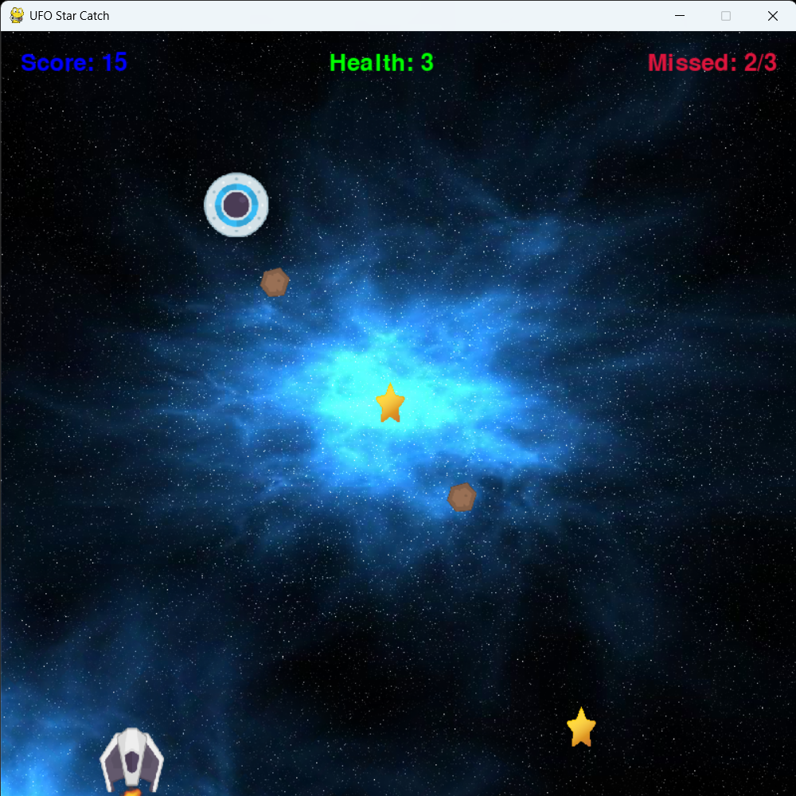
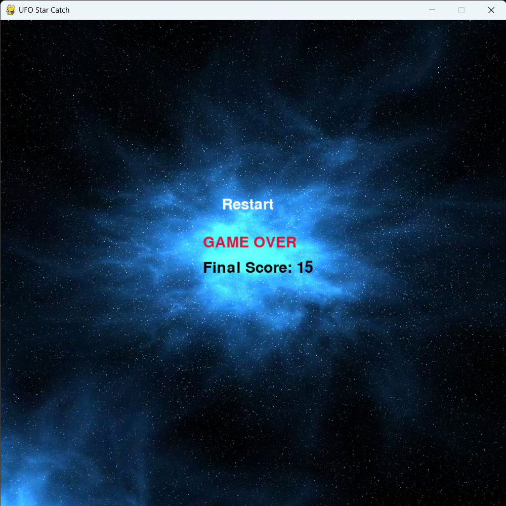

# 🚀 UFO Star Catch

📌 **Baran Güven** - Öğrenci No: **23253001**  
📅 Proje Tarihi: 18.05.2025  

---

## 🎮 Oyun Hakkında

"**UFO Star Catch**", Pygame kütüphanesi kullanılarak geliştirilmiş eğlenceli bir 2D refleks oyunudur. Oyunda amaç, ufodan düşen yıldızları uzay gemisiyle yakalamak ve meteor çarpmalarından kaçınmaktır.

Oyuncu, ekrandaki uzay gemisini klavye ya da dokunmatik hareketlerle kontrol eder. Yıldızları toplayarak puan kazanırken, meteorlara çarptıkça can kaybeder.

---

## 🕹️ Nasıl Oynanır?

- **← → Tuşları** ile uzay gemisini sağa/sola hareket ettir.
- Mobil cihazlarda veya dokunmatik ekranlarda parmağını kaydırarak kontrol sağlanabilir.
- UFO'dan düşen **yıldızları toplayarak** puan kazan.
- **Meteorlardan kaçın**, aksi halde can kaybedersin.
- 3 yıldız kaçırırsan(art arda) ya da canın biterse **Game Over** ekranı gelir.
- Skorun 143 olduğunda özel bir **sürpriz** seni bekliyor 🎁

---

## 💻 Kullanılan Teknolojiler

- Python (v3.x)
- Pygame kütüphanesi
- Görseller ve animasyonlar (PNG)
- Ses dosyaları (MP3/WAV)

---

## 🖼️ Oyun Görselleri

Aşağıda oyunun bazı ekran görüntüleri bulunmaktadır:

### Oyun Ekranı


### Game Over


> Görseller `images` klasörüne konulmalı ve `README.md` ile aynı dizinde olmalı.

---

## 🛠️ Projeyi Çalıştırmak

1. Python 3 ve pygame yüklü olmalıdır:

```bash
pip install pygame
